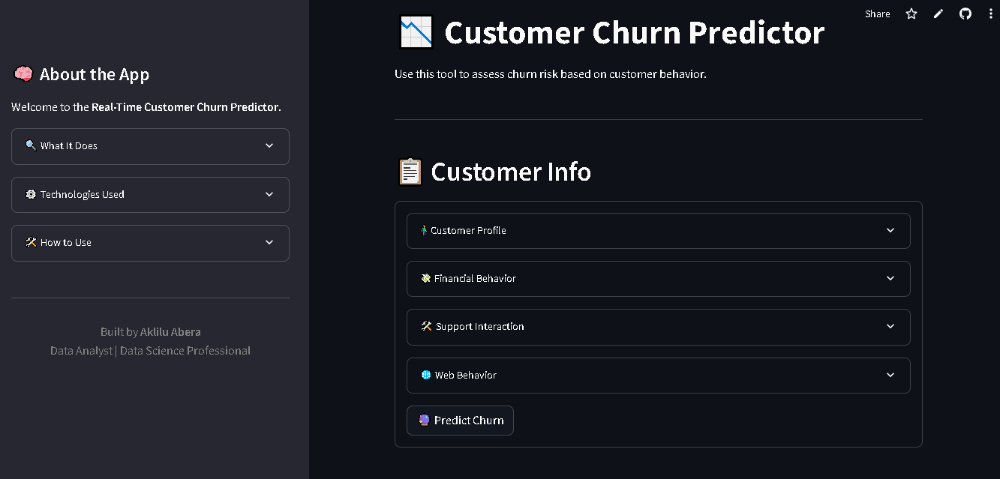

# Customer Churn Predictor App

A machine learning-powered web application that predicts customer churn risk in real-time, helping businesses proactively retain valuable customers

## Live Demo
[Try the Live App on Streamlit Cloud](https://churn-predictor-app-f3oxmdkd5dvynh8hhkkege.streamlit.app)

## What It Does
-  Predicts churn risk using a trained ML model
-  Accepts user inputs like age, tenure, tickets, web usage, etc.
-  Provides churn probability + risk level
-  Built for executives and analysts to take proactive action
-  Designed with real-world data flow in mind

## Tech Stack
- *Python*- Data processing & model development
- *Scikit-learn*- ML model training & prediction
- *Streamlit*-Web app UI and deployment 
- *Pandas/Numpy*-Feature handling      
- *Joblib*-Model serialization
- *Git + GitHub*- Version control & collaboration 

## Model Overview
- Trained on synthetic customer data simulating CRM, transaction, and usage info
- Achieved good baseline metrics and interpretable outputs
- Churn prediction based on multiple inputs like
      - Tenure
      - Ticket history
      - Web activity
      - & Financial engagement

